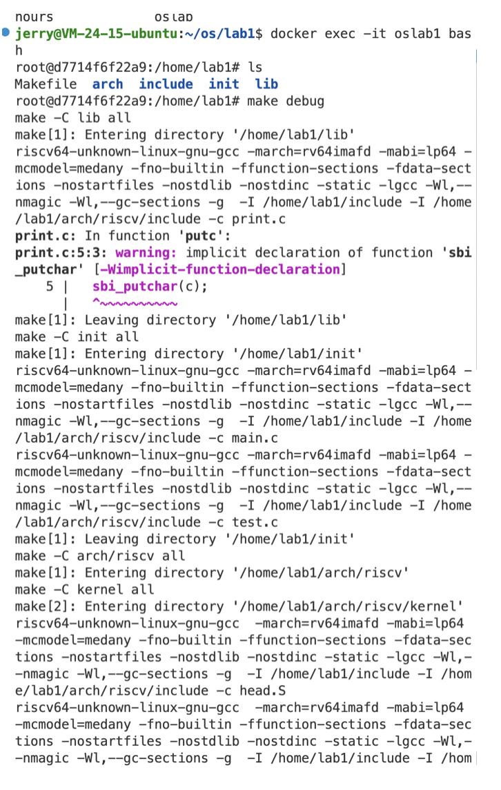
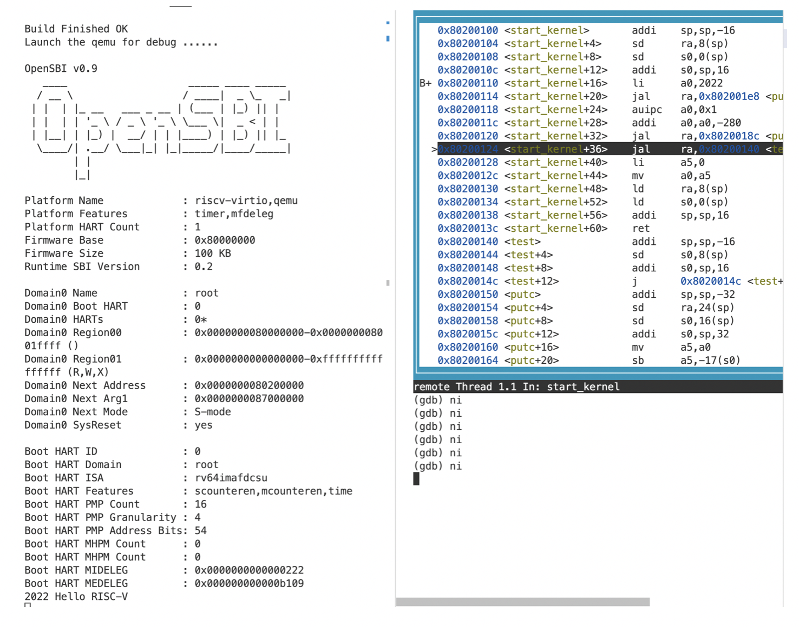
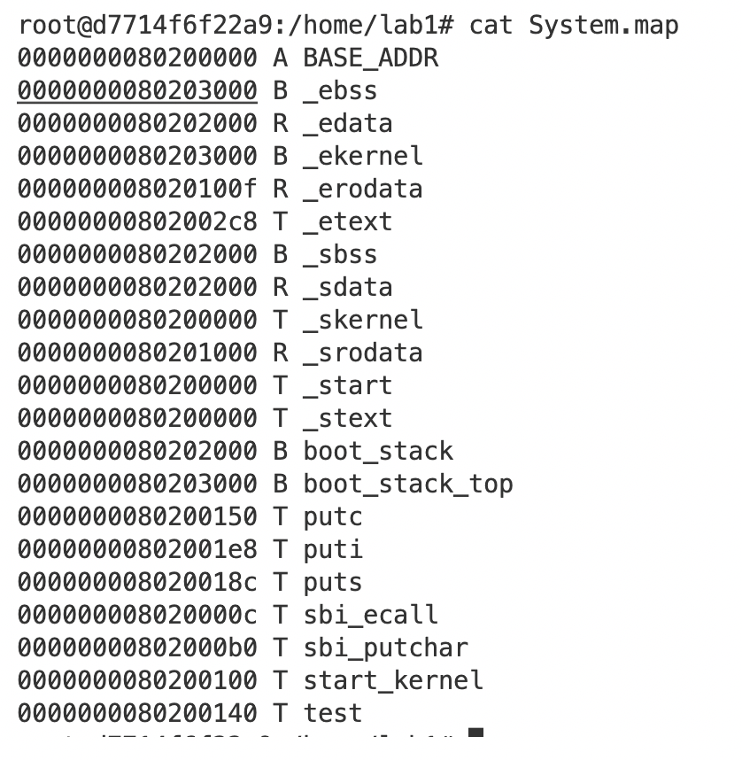

# **浙江大学实验报告**

课程名称：   操作系统     实验类型：     综合型        

实验项目名称：     实验1 Rinux内核引导                        

学生姓名：  管嘉瑞   专业： 计算机科学与技术 学号：  3200102557         

电子邮件地址： 3200102557@zju.edu.cn  手机: 

实验日期： 2022 年  10 月 10 日

# 一、实验目的

学习 RISC-V 汇编， 编写 head.S 实现跳转到内核运行的第一个 C 函数。

学习 OpenSBI，理解 OpenSBI 在实验中所起到的作用，并调用 OpenSBI 提供的接口完成字符的输出。

学习 Makefile 相关知识， 补充项目中的 Makefile 文件， 来完成对整个工程的管理。

# 二、实验内容

部署Rinux内核代码，编写Makefile，完成内联汇编相关代码，为sbi接口补充代码，实现Rinux的启动和字符串输出。

# 三、主要仪器设备

riscv-64服务器环境

操作系统：Linux 5.4.0-121-generic

主要工具：docker, qemu, riscv-gnu-toolchain

# 四、操作方法和实验步骤

1. docker环境下部署代码框架

2. 编写head.S

    ```
    .extern start_kernel
    
        .section .text.entry
        .globl _start
    _start:
        la sp, boot_stack_top
        jal start_kernel
    
        .section .bss.stack
        .globl boot_stack
    boot_stack:
        .space 4096 # <-- change to your stack size
    
        .globl boot_stack_top
    boot_stack_top:
    
    ```

    la sp, boot_stack_top将sp设为boot_stack_top的地址。栈设置完成后，jal跳转到start_kernel处执行。

    .space 4096在_start后添加0x2000个byte的空间。

3. 完善lib/Makefile脚本

    ```makefile
    C_SRC       = $(sort $(wildcard *.c))
    OBJ		    = $(patsubst %.c,%.o,$(C_SRC))
    
    all:$(OBJ)
    	
    %.o:%.c
    	${GCC} ${CFLAG} -c $<
    	
    clean:
    	$(shell rm *.o 2>/dev/null)
    
    
    ```

    此处利用扩展通配符wildcard和替换通配符patsubst获得编译所需要的对象。

4. 补充sbi.c

    ```c
    #include "types.h"
    #include "sbi.h"
    
    
    struct sbiret sbi_ecall(int ext, int fid, uint64 arg0,
    			            uint64 arg1, uint64 arg2,
    			            uint64 arg3, uint64 arg4,
    			            uint64 arg5) 
    {
    	struct sbiret ret;
    	register uint64 a0 asm ("a0") = (uint64)(arg0);
    	register uint64 a1 asm ("a1") = (uint64)(arg1);
        register uint64 a2 asm ("a2") = (uint64)(arg2);
    	register uint64 a3 asm ("a3") = (uint64)(arg3);
    	register uint64 a4 asm ("a4") = (uint64)(arg4);
    	register uint64 a5 asm ("a5") = (uint64)(arg5);
    	register uint64 a6 asm ("a6") = (uint64)(fid);
    	register uint64 a7 asm ("a7") = (uint64)(ext);
    
    	asm volatile("ecall"
    		: "+r" (a0), "+r" (a1)
    		: "r" (a0),"r" (a1),"r" (a2),"r" (a3),"r" (a4),"r" (a5),"r" (a6),"r" (a7)
    		: "memory");
    	ret.error = a0;
    	ret.value = a1;
    
    	return ret;
    }
    
    void sbi_putchar(unsigned c) 
    {
    	sbi_ecall(SBI_PUTCHAR, 0, c, 0, 0, 0, 0, 0);
    }
    
    
    ```

    openSBI在M态为S态提供接口，此处sbi_ecall接口可以修改寄存器的值。此处，将函数参数arg0 ~ arg5 放入寄存器 a0 ~ a5 中，将 ext (Extension ID) 放入寄存器 a7 中，fid (Function ID) 放入寄存器 a6 中。

    ecall 指令执行 之后系统会进入M模式，之后OpenSBI会完成相关操作。OpenSBI的返回结果存放在寄存器 a0、a1中，其中a0为error code，a1为返回值，用sbiret接收。

    这里利用了内联汇编执行了ecall指令并表示了哪些寄存器的值可能被修改。

    此外，实现sbi_putchar函数实现了打印字符，作为后续多种打印函数的接口。

5. puts和putsi

    利用已经实现的putchar函数可以实现多种打印功能，打印字符串、整数，在print.c中实现。

    ```c
    #include "print.h"
    #include "sbi.h"
    
    void putc(char c) {
      sbi_putchar(c);
    }
    
    void puts(char *s) {
      while((*s) != '\0') {
        sbi_putchar(*s);
        s++;
      }
    }
    
    void puti(int x) {
        int digit = 1;
        int tmp = x;
    
        while (tmp >= 10) {
            digit *= 10;
            tmp /= 10;
        }
    
        while (digit >= 1) {
            sbi_putchar('0' + x/digit);
            x %= digit;
            digit /= 10;
        }
    }
    
    
    ```

6. 修改defs.h

    defs.h中实现了读写csr寄存器的宏。利用内联汇编可以实现。

    ``` c
    #ifndef _DEFS_H
    #define _DEFS_H
    
    #include "types.h"
    
    #define csr_read(csr)                       \
    ({                                          \
        register uint64 __v;                    \
        /* unimplemented */                     \
        asm volatile ("csrr %0, " #csr          \
                        : "=r" (__v) :          \
                        : "memory");            \
        __v;                                    \
    })
    
    #define csr_write(csr, val)                         \
    ({                                                  \
        uint64 __v = (uint64)(val);                     \
        asm volatile ("csrw " #csr ", %0"               \
                        : : "r" (__v)                   \
                        : "memory");                    \
    })
    
    #endif
    
    ```

    

# 五、实验结果和分析

打开两个终端，进入docker。

\### Terminal 1（编译运行内核）

\#make debug

 

\### Terminal 2（利用qemu远程调试）

\# riscv64-unknown-linux-gnu-gdb  vmlinux

(gdb) target remote:1234  # 连接 qemu

(gdb) b start_kernel    # 设置断点

(gdb) continue       # 继续执行



可以利用layout asm查看start_kernel附近的汇编代码，用ni指令单步调试。

单步调试过程中，字符串逐步输出，最终输出“2022 Hello RISC-V”


# 六、问题解答

1. 请总结一下 RISC-V 的 calling convention，并解释 Caller / Callee Saved Register 有什么区别？

    **Calling Convention:**

    a. 调用传参的寄存器，整数型有八个a0～a7，浮点型也有八个f0～f7

    b. 结构体参数的每个参数要按照所在平台上指针类型大小对齐。由于至多有8个寄存器，所以结构体至多8个成员会被放在寄存器中，剩余的部分被存放在栈上，sp指向第一个没有被存放在寄存器上的结构体成员。

    c. 栈是从高地址向低地址方向的， 并且是16字节对齐的。

    d. 寄存器t0t6，ft0ft11被称为临时寄存器，由调用者保存。s0~s11, fs0~fs11由被调者保存。

    **Caller-saved registers**：存储暂时性的、无需被保留的值的寄存器。调用过程中这些寄存器的值可能会被改变，如果需要保留这些寄存器的值，调用前必须先存入栈中或拷贝到其他位置，防止丢失。 

    **Callee-saved registers** ：存储非暂时的、调用时被保留的值。调用发生时，其值在前后不应该被改变。如果调用过程中调用者不得不需要修改，则在返回前必须复原。

    两者最主要的区别就在于寄存器的值如果需要在调用前后保持，到底是caller负责保存（压栈或复制）还是callee负责保存（备份并还原）。

2. 编译之后，通过 System.map 查看 vmlinux.lds 中自定义符号的值

    

    直接查看System.map的内容即可。

# 七、讨论、心得

1. Makefile是非常重要的构建工具，有着自己的一套语法，需要掌握。掌握Makefile对阅读工程代码帮助较大。
2. RISC-V的三种特权模式的含义要掌握，SBI可以建立S和M态的接口。
3. 不同寄存器有不同特性，caller saved和callee saved的寄存器模式不同。
4. 内联汇编语法含义需要理解掌握。


