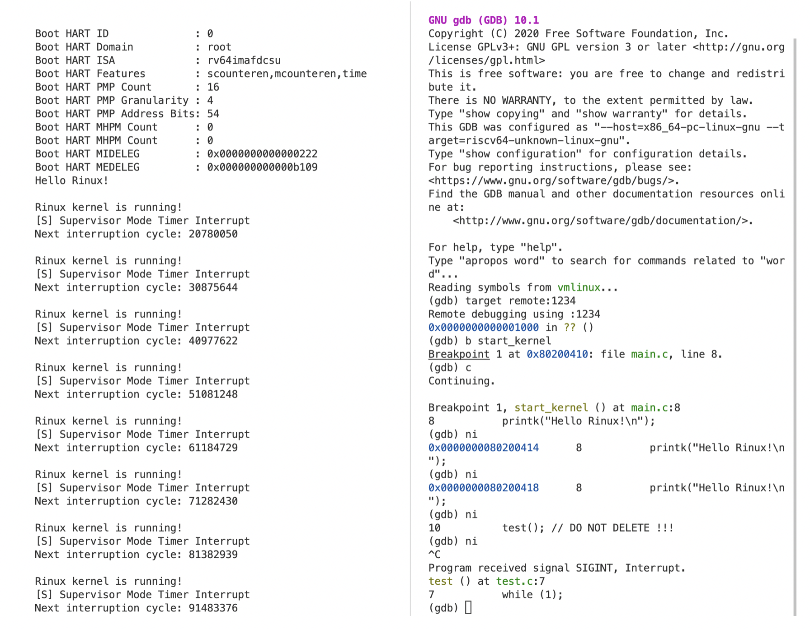

# **浙江大学实验报告**

课程名称：   操作系统     实验类型：     综合型        

实验项目名称：     实验2 RV64时钟中断处理                     

学生姓名：  管嘉瑞   专业： 计算机科学与技术 学号：  3200102557         

电子邮件地址： 3200102557@zju.edu.cn  手机:     

实验日期： 2022 年  10 月 17 日

# 一、实验目的

学习 RISC-V 的异常处理相关寄存器与指令，完成对异常处理的初始化。

理解 CPU 上下文切换机制，并正确实现上下文切换功能。

编写异常处理函数，完成对特定异常的处理。

调用OpenSBI提供的接口，完成对时钟中断事件的设置。

# 二、实验内容

理解并完成异常处理所需的初始化工作，编写异常处理函数，实现时钟中断。

# 三、主要仪器设备

riscv-64服务器环境

操作系统：Linux 5.4.0-121-generic

主要工具：docker, qemu, riscv-gnu-toolchain

# 四、操作方法和实验步骤

1. 部署代码框架，先用printk替换lab1的字符打印函数（功能更完备）。

    然后修改vmlinux.lds，加入.text.init

2. 修改head.S, 将_start放在.text.init，并进行异常处理的初始化。

    ```
    //head.S
    .extern start_kernel
        .section .text.init
        .globl _start
    _start:
        # YOUR CODE HERE
        la sp, boot_stack_top
    
        # set stvec = _traps (Direct，直接就是异常处理函数)
        la t0, _traps
        csrw stvec, t0
    
        # set sie[STIE] = 1 (开启S模式下时钟中断的响应)
        csrr t0, sie
        ori t0, t0, 0x20
        csrw sie, t0
    
        # set first time interrupt
        rdtime t0
        li t1, 10000000
        add a0, t0, t1
        add a6, zero, zero
        add a7, zero, zero
        ecall
    
        # set sstatus[SIE] = 1 (开启S模式下中断响应)
        csrr t0, sstatus
        ori t0, t0, 0x2
        csrw sstatus, t0
    
        # goto start_kernel
        jal start_kernel
    
        # - your lab1 code -
        .section .bss.stack
        .globl boot_stack
    boot_stack:
        .space 4096 # <-- change to your stack size
        .globl boot_stack_top
    boot_stack_top:
    
    ```

    在jal之前，先进行了异常处理有关的初始化。首先将_traps地址载入stvec中，使得其作为异常处理的函数（这里做了简化处理，采用Direct的方式，没有中断向量表）。然后通过设置寄存器的值开启S模式下中断响应和时钟中断响应。设置了初始的时钟中断。

3. 实现上下文切换，在跳转到中断处理函数之前需要保存上下文并在返回时恢复。保存CPU的寄存器（上下文）到内存中（栈上）。共有32个通用寄存器x0 ~ x31，注意x0衡为0，而x1是返回地址，x2是栈指针。

    此外，还需要将scause和sepc中的值传入异常处理函数trap_handle。完成对异常的处理之后，从内存中（栈上）恢复CPU的寄存器

    ```
    //entry.S
    .equ reg_size, 0x8    
        
        .section .text.entry
        .align 2
        .globl _traps 
    _traps:
        # YOUR CODE HERE
        # 1. save 32 registers and sepc to stack
        csrw sscratch, sp 
        addi sp, sp, -32*reg_size
    
        sd x1, 0*reg_size(sp)
        sd x3, 2*reg_size(sp)
        //... omitted
    
        csrr t0, sepc
        sd t0, 31*reg_size(sp)
    
        # 2. call trap_handler (sscratch ??) (pass a0, a1 as parameters)
        csrrw t0, sscratch, x0
        sd t0, 1*reg_size(sp)
    
        csrr a0, scause
        csrr a1, sepc
        mv a2, sp
    
        call trap_handler
    
        #3. restore sepc and 32 registers(x2(sp) should be restore last)from stack
        ld t0, 31*reg_size(sp)
        csrw sepc, t0
    
        ld x1, 0*reg_size(sp)
        ld x3, 2*reg_size(sp)
        ld x4, 3*reg_size(sp)
    		//... omitted
    		
        ld x2, 1*reg_size(sp)
    
        # 4. return from trap
        sret
    ```

4. 实现异常处理函数

    在arch/riscv/kernel/trap.c文件中编写异常处理函数。其中trap_handler会在_traps中被调用。这里根据scause的值分辨是中断还是异常，如果是中断，也能判断出是否是时钟中断。这里MASK的值的确定需要对scause寄存器的比特位功能有所理解。

    在确定是时钟中断后，打印相关信息。

    ```c
    // trap.c 
    #include "trap.h"
    #include "types.h"
    #include "clock.h"
    #include "printk.h"
    
    void exception_handler(unsigned long scause, unsigned long sepc)
    {
        //ignore
        printk("[S] Exeception happens!\n");
    }
    
    void interrupt_handler(unsigned long scause, unsigned long sepc)
    {
        switch(scause & ~TRAP_SCAUSE_MASK)
        {
            case SUPERVISOR_TIMER_INTERRUPT:
                // 如果是timer interrupt 则打印输出相关信息, 并通过 `clock_set_next_event()` 设置下一次时钟中断
                printk("\nRinux kernel is running!\n");
                //printk("Current CPU Time %d: ", get_cycles());
                printk("[S] Supervisor Mode Timer Interrupt\n");
                clock_set_next_event();
                break;
            default:
                printk("[S] Supervisor Mode Not-timer Interrupt\n");
                break; // ignore other interruption
        }
    }
    
    void trap_handler(unsigned long scause, unsigned long sepc) {
        // 通过 `scause` 判断trap类型
        if(scause & TRAP_SCAUSE_MASK) //TRAP_SCAUSE_MASK = (1UL << 63)
        {
            // 如果是interrupt 判断是否是timer interrupt
            interrupt_handler(scause, sepc);
        }
        else
        {
            exception_handler(scause, sepc);
        }
    
        // 其他interrupt / exception 可以直接忽略
    }
    
    ```

5. 实现时钟中断相关函数

    ```c
    // clock.c
    #include "clock.h"
    #include "sbi.h"
    
    // QEMU中时钟的频率是10MHz, 也就是1秒钟相当于10000000个时钟周期。
    unsigned long TIMECLOCK = 10000000;
    
    unsigned long get_cycles() {
        unsigned long num;
        asm volatile("rdtime %0" : "=r"(num));
        return num; 
    }
    
    void clock_set_next_event() {
        // 下一次 时钟中断的时间点
        unsigned long next = get_cycles() + TIMECLOCK;
        printk("Next interruption cycle: %d\n", next);
    
        // 使用 sbi_ecall 来完成对下一次时钟中断的设置
        sbi_ecall(SBI_SETTIMER, 0, next, 0, 0, 0, 0, 0);
    } 
    
    ```

    这里获取时钟周期的函数需要用到内联汇编，通过sbi_ecall接口完成时钟中断设置。

    这里我在设置下一次中断时间的同时进行了打印时钟周期数的操作，便于检测中断是否按计划进行。

    

# 五、实验结果和分析

打开两个终端，进入docker。

\### Terminal 1（编译运行内核）

\#make debug

\### Terminal 2（利用qemu远程调试）

\# riscv64-unknown-linux-gnu-gdb  vmlinux

(gdb) target remote:1234  # 连接 qemu

(gdb) b start_kernel    # 设置断点

(gdb) continue       # 继续执行



单步调试到到while死循环时，时钟中断开始起作用，每隔一秒进行一次信息输出。

可以发现中断的时钟周期间隔并不是严格的10000000，而是稍多一些。这是因为在触发中断处理函数后，中断处理函数本身（比如get_cycles这一部分），也需要消耗一些时钟周期来完成，随后才根据已经延迟了的时钟周期设置下一个中断点。所以很难实现严格地1秒一次时钟中断。

```c
void clock_set_next_event() {
    // 下一次 时钟中断的时间点
    unsigned long next = get_cycles() + TIMECLOCK;
    printk("Next interruption cycle: %d\n", next);

    // 使用 sbi_ecall 来完成对下一次时钟中断的设置
    sbi_ecall(SBI_SETTIMER, 0, next, 0, 0, 0, 0, 0);
} 
```


# 六、问题解答

medeleg：Machine exception delegation register. （机器模式异常代理寄存器）

mideleg：Machine interrupt delegation register.（机器模式中断代理寄存器）

一般来讲，异常和中断都在M模式下进行处理。但出于效率考虑，有时可以将trap交给更低权限的模式（S或U）进行处理。通过对medeleg和mideleg寄存器中的某些比特设为1，可以将对应exception code的trap交给低特权级进行处理。

S模式下也有对应的sedeleg和mideleg，功能也是帮助将trap交给低权限模式(U模式)处理。


# 七、讨论、心得

1. 要区分异常处理过程中架构自动实现的部分和需要OS设计者自行操作的部分。
1. 这里mtvec采用Direct的方式，较简单，如果是中断向量表，需要考虑如何跳转到正确的异常处理函数。
1. 理想与现实有差别，比如此实验中发现无法严格地每10M个时钟设置一次中断。实际设计中一定要考虑这种细节问题。


