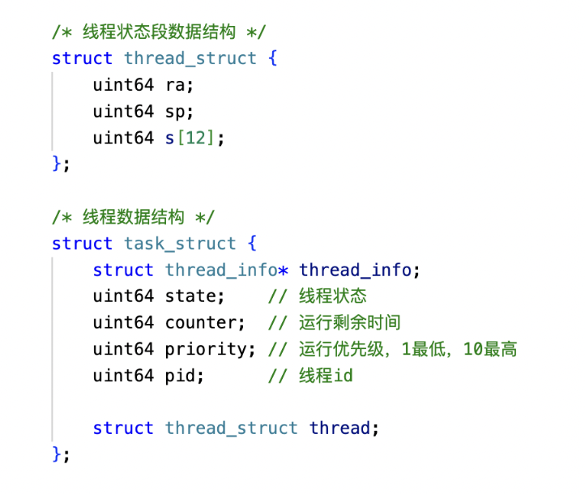
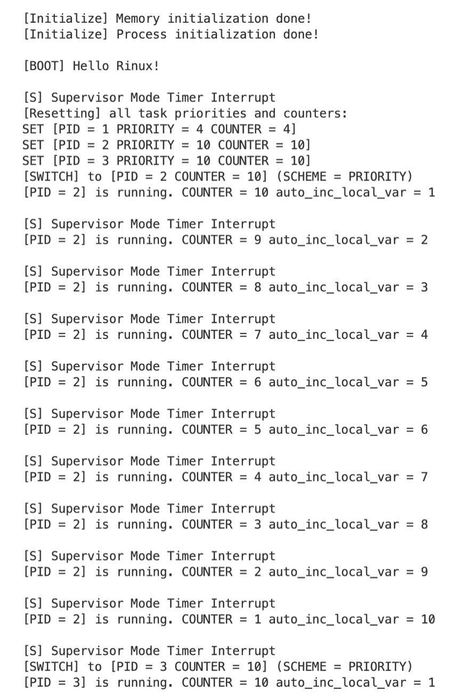
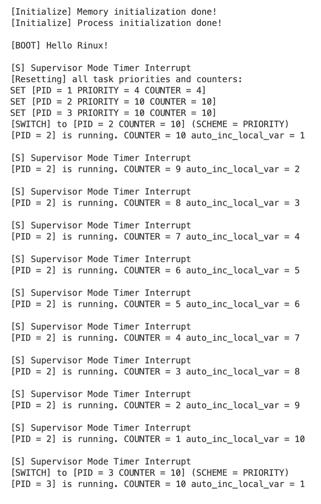
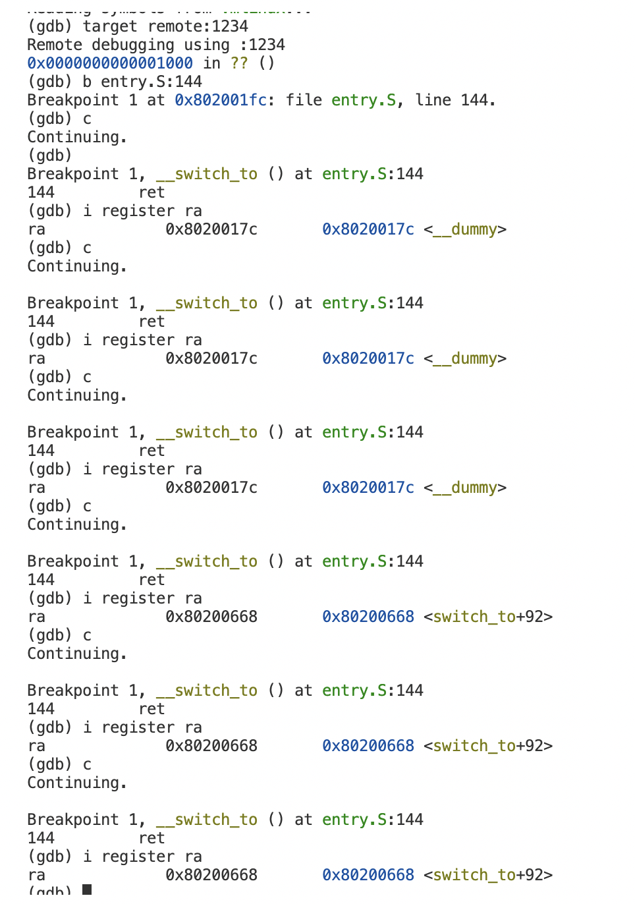

# **浙江大学实验报告**

课程名称：   操作系统     实验类型：     综合型        

实验项目名称：   实验3 RV64内核线程调度                     

学生姓名：  管嘉瑞   专业： 计算机科学与技术 学号：  3200102557         

电子邮件地址： 3200102557@zju.edu.cn  手机: 

实验日期： 2022 年  10 月 31 日


# 一、实验目的

了解线程概念，并学习线程相关结构体，并实现线程的初始化功能。

了解如何使用时钟中断来实现线程的调度。

了解线程切换原理，并实现线程的切换。

掌握简单的线程调度算法，并完成两种简单调度算法的实现。

# 二、实验内容

初始化内存和进程管理信息。实现线程调度过程中短上下文切换。分别使用短作业优先调度算法和优先级调度算法完成调度函数，在时钟中断中调用、达到切换线程的效果。

# 三、主要仪器设备

riscv-64服务器环境

操作系统：Linux 5.4.0-121-generic

主要工具：docker, qemu, riscv-gnu-toolchain


# 四、操作方法和实验步骤

1. 部署代码框架，从repo中同步源代码文件rand.h/rand.c，string.h/string.c，mm.h/mm.c。mm.h和mm.c提供了简单的物理内存管理接口，rand.h和rand.c提供rand()接口用以提供伪随机数序列，string.h和string.c提供了memset接口用以初始化一段内存空间。

    需要在defs.h中补充宏定义。提供的内存管理机制采用按页分配、释放的方式，并且按4KB进行地址对齐。注意_ekernel所在页后1未用到的部分会被浪费。

2. 修改head.S, 添加内存初始化和进程初始化调用

    ```
    //head.S
    //omitted
    call mm_init # initialize physical memory
    
    call task_init # initialize task threads
    //omitted
    ```

3. 进行进程的状态初始化，分为初始化idle进程和其他进程两部分，

    ```c
    //proc.c
    void task_init() {
        // 1. 调用 kalloc() 为 idle 分配一个物理页
        idle = (struct task_struct*)kalloc();
        // 2. 设置 state 为 TASK_RUNNING;
        idle->state = TASK_RUNNING;
        // 3. 由于 idle 不参与调度 可以将其 counter / priority 设置为 0
        idle->counter = 0;
        idle->priority = 0;
        // 4. 设置 idle 的 pid 为 0
        idle->pid = 0;
        // 5. 将 current 和 task[0] 指向 idle
        current = idle;
        task[0] = idle;
    
        /* YOUR CODE HERE */
        // 1. 参考 idle 的设置, 为 task[1] ~ task[NR_TASKS - 1] 进行初始化
        // 2. 其中每个线程的 state 为 TASK_RUNNING, counter 为 0, priority 使用 rand() 来设置, pid 为该线程在线程数组中的下标。
        // 3. 为 task[1] ~ task[NR_TASKS - 1] 设置 `thread_struct` 中的 `ra` 和 `sp`,
        // 4. 其中 `ra` 设置为 __dummy （见 4.3.2）的地址， `sp` 设置为 该线程申请的物理页的高地址
        /* YOUR CODE HERE */
        for(uint64 i = 1; i < NR_TASKS; i++)
        {
            task[i] = (struct task_struct*)kalloc();
            task[i]->counter = 0;
            task[i]->priority = rand();
            task[i]->pid = i;
    
            task[i]->thread.ra = (uint64)&__dummy;
            task[i]->thread.sp = (uint64)task[i] + PGSIZE;
        }
    
        printk("[Initialize] Process initialization done!\n");
    }
    ```

4. 在entry.S中添加__dummy

    ```c
    //entry.S
    __dummy:
        # YOUR CODE HERE
        la t0, dummy
        csrw sepc, t0
        sret
    ```

5. 实现进程切换中的上下文切换

    注意这里switch的参数在proc.c的switch函数传入，a0是旧进程，a1是要切换到的新进程，此函数做的是将旧进程的上下文保存，切换到新进程的上下文。

    这里以5 * regsize作为初始偏移，是因为参数是结构体task_struct的指针，其对应上下文的信息字段偏移从5 * regsize开始。

    

    ```c
    //entry.S  
    	.globl __switch_to
    __switch_to:
        # save state to prev process
        # YOUR CODE HERE
        # a0: prev
        # a1: next
        # bias is based on the structure of task_struct
        sd ra, 5*reg_size(a0)
        sd sp, 6*reg_size(a0)
        sd s0, 7*reg_size(a0)
        sd s1, 8*reg_size(a0)
        sd s2, 9*reg_size(a0)
        sd s3, 10*reg_size(a0)
        sd s4, 11*reg_size(a0)
        sd s5, 12*reg_size(a0)
        sd s6, 13*reg_size(a0)
        sd s7, 14*reg_size(a0)
        sd s8, 15*reg_size(a0)
        sd s9, 16*reg_size(a0)
        sd s10, 17*reg_size(a0)
        sd s11, 18*reg_size(a0)
    
        # restore state from next process
        # YOUR CODE HERE
        ld ra, 5*reg_size(a1)
        ld sp, 6*reg_size(a1)
        ld s0, 7*reg_size(a1)
        ld s1, 8*reg_size(a1)
        ld s2, 9*reg_size(a1)
        ld s3, 10*reg_size(a1)
        ld s4, 11*reg_size(a1)
        ld s5, 12*reg_size(a1)
        ld s6, 13*reg_size(a1)
        ld s7, 14*reg_size(a1)
        ld s8, 15*reg_size(a1)
        ld s9, 16*reg_size(a1)
        ld s10, 17*reg_size(a1)
        ld s11, 18*reg_size(a1)
        ret
    
    ```

6. 实现调度函数

    在时钟中断处理中，调用do_timer函数，此函数会对正在执行的非idle进程的counter减一，然后进行调用调度函数schedule。

    根据调度策略(SJF或PRIORITY)，将schedule函数分为两套，其思路都是：选出符合调度策略的下一个进程()。其中SJF算法筛选出counter最小的进程，而PRIORITY算法则选出priority最大的。注意PRIORITY算法中，在初始化后可以用counter表示优先级大小，所以通过counter筛选。为了方便测试，在开始时和所有非idle进程都执行完成(counter=0)时，将对所有非idle进程的counter和priority进行重置（priority和counter设为同一值），重新进行调度。

    ```c
    //proc.c
    #ifdef SJF
    void schedule(void) {
        /* YOUR CODE HERE */
        struct task_struct* next = task[0];
    
        while(1)
        {
            for(uint64 i = 1; i < NR_TASKS; i++)
            {
                if(task[i]->state == TASK_RUNNING && task[i]->counter > 0 
                    && (task[i]->counter < next->counter || next->pid == 0))
                {
                    next = task[i];
                }
            }
    
            if(next->pid != 0) //选中下一个进程
                break;
            reset_all_counter();//除了0进程外所有进程counter均为0, 重置counter重新调度
        }
        printk("[SWITCH] to [PID = %d COUNTER = %d] (SCHEME = SJF)\n", next->pid, next->counter);
        switch_to(next);
    }
    #elif PRIORITY
    void schedule()
    {
        /* YOUR CODE HERE */
        struct task_struct* next = task[0];
    
        while (1) 
        {
    		int max_counter = 0;
            for(int i = 1; i < NR_TASKS; i++)
            {
                if(task[i] -> state == TASK_RUNNING && task[i] -> counter > max_counter)
                {
                    next = task[i];
                    max_counter = task[i] -> counter;
                }
            }
            //here, next has max counter, max_counter is the max counter value
    
    		if(max_counter != 0)
                break;
            reset_all_priority_counter();
    	}
        printk("[SWITCH] to [PID = %d COUNTER = %d] (SCHEME = PRIORITY)\n", next->pid, next->counter);
        switch_to(next);
    }
    #endif
    
    ```

    

# 五、实验结果和分析

打开终端，进入docker。

\### Terminal （编译运行内核）

#make run

以非idle任务数设为3进行展示，方便查看：

SJF算法：



PRIORITY算法：



可以看到能在任务中进行切换。由于设置机制，两种算法的表现相同，但原理不同。SJF算法优先安排counter最小的进程，而PRIORITY算法优先安排优先级最高的进程。


# 六、问题解答

Q1

本实验中， `context_switch`一定是在中断引起的。根据实验二的内容，我们已经在栈上保存了其他的寄存器，因此只需要保存`ra`,`sp`,`s0-s11`即可。

Q2

在debug模式下，在__switch_to函数的ret处设置断点( (gdb) b entry.S:144 )

用i register ra指令查看ra寄存器的值。



可以看到每个线程在第一次被调用时，ra确实是__dummy的地址。但在后来被调用时，ra的内容是<switch_to + 92>。

也就是0x80200668的位置。经查看此处是`__swicth_to`的下一行，亦是_traps的restore部分。因此，效果相当于线程第一次调用时无需进行restore，而是设置sepc，后面才需要restore，不设置sepc。


# 七、讨论、心得

1. 内存初始化中为了4KB对齐需要设计稍复杂一些，并浪费一些空间，但是值得的。
1. SJF算法理论上最优，但实际上不可行，因为无法知道线程剩余的CPU burst time。优先级调度算法中用到的counter和SJF算法中含义不相同，它由priority初始化，不断减小。在最初被筛选调度时，是priority的代表。
1. 上下文切换中要注意结构体的结构，错误的地址或偏移会导致异常。
1. 本实验只是简化版的线程调度，实际的模型可能更为复杂。


