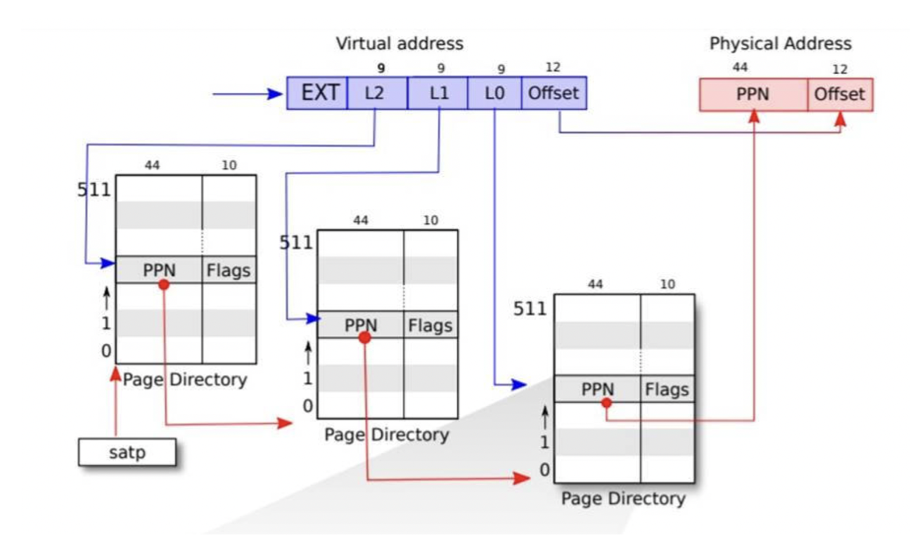
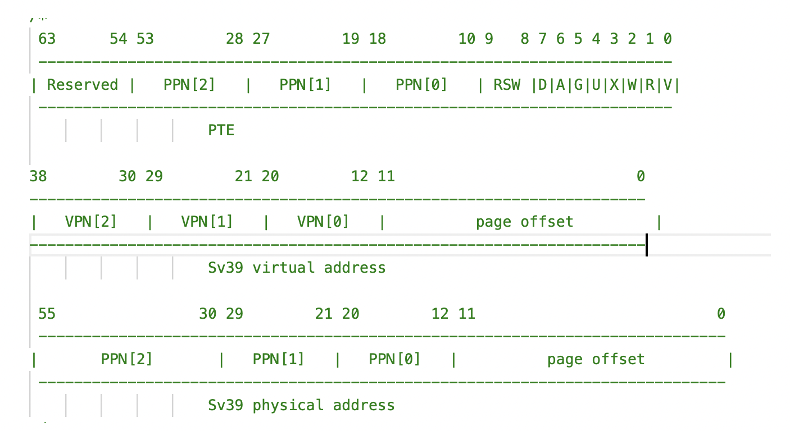
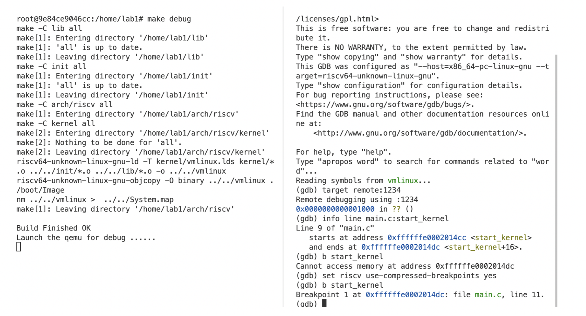
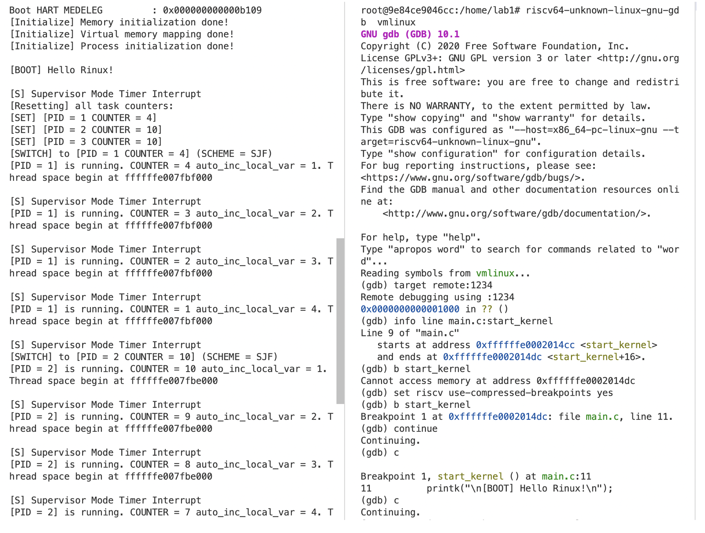
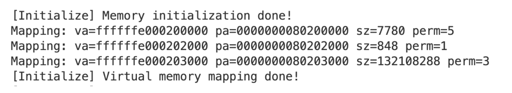
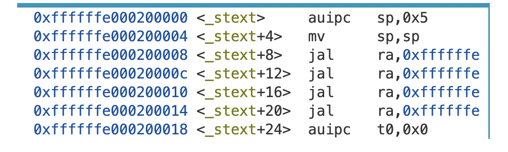

# **浙江大学实验报告**

课程名称：   操作系统     实验类型：     综合型        

实验项目名称：   实验4 RV64虚拟内存管理                     

学生姓名：  管嘉瑞   专业： 计算机科学与技术 学号：  3200102557         

电子邮件地址： 3200102557@zju.edu.cn  手机：       

实验日期： 2022 年  11 月 21 日


# 一、实验目的

学习虚拟内存的相关知识，实现物理地址到虚拟地址的切换。

了解RISC V架构中SV39分页模式，实现虚拟地址到物理地址的映射，并对不同的段进行相应的权限设置。

了解多级页表映射方法，创建并使用页表进行地址映射。

# 二、实验内容

构建三级页表，按照RSV39分页模式进行虚拟地址到物理地址的映射。

原理图：



Page Table Entry和虚拟地址、物理地址的结构如图



# 三、主要仪器设备

riscv-64服务器环境

操作系统：Linux 5.4.0-121-generic

主要工具：docker, qemu, riscv-gnu-toolchain

# 四、操作方法和实验步骤

1. 部署代码框架，从repo中同步源代码文件vm.c和Makefile

2. 修改head.S，进行虚拟内存初始化工作

    ```
    _start:
        la sp, boot_stack_top
    
        call setup_vm_prepare
        call relocate
        call mm_init # initialize physical memory
        call setup_vm_map
    ```

3. 实现set_vm_prepare, 进行直接映射和偏移映射两段映射。

    注意这里没有直接在函数里写satp，而是在后面的relocate中进行。

    直接映射只映射1GB，且只用到了根页表，具体作用参考思考题。

    ```c
    void setup_vm_prepare(void) {
        memset(pgtbl_prepare, 0, PGSIZE);
        
        uint64 addr_phy_start = PHY_START;
        uint64 phy_index = (addr_phy_start & PPN2MASK) >> 30; //phy_index = PPN2 of addr_phy_start
        pgtbl_prepare[phy_index] = (phy_index << 28) | 0xF; //set PPN[2]. DAGUXWRV = 00001111。后几位不全为0，一级页表直接映射
    
        uint64 addr_vm_start= VM_START;
        uint64 vm_index = (addr_vm_start & VPN2MASK) >> 30;
        pgtbl_prepare[vm_index] = (phy_index << 28) | 0xF; //映射到同一段物理内存
    }
    
    ```

4. 实现create_mapping

    此函数的功能是对pa开始的sz大小的内存范围进行映射，映射到va->va+sz这一段，按页整体进行，perm表示读写权限。

    这里是实验最为关键的部分，是多级页表的构建部分，按照多个分支逻辑进行构建。

    ```c
    /* 创建多级(3级)页表映射关系 */
    void create_mapping(uint64 *pgtbl, uint64 va, uint64 pa, uint64 sz, int perm) {
        /*
        pgtbl 为根页表的基地址
        va, pa 为需要映射的虚拟地址、物理地址
        sz 为映射的大小
        perm 为映射的读写权限
    
        创建多级页表的时候可以使用 kalloc() 来获取一页作为页表目录
        可以使用 V bit 来判断页表项是否存在
        */
    
        //printk("Mapping: va=%lx pa=%lx sz=%d perm=%d\n", va, pa, sz, perm);
        uint64* pgtbl1, *pgtbl0;
        uint64 paddr, vaddr, va_idx2, va_idx1,va_idx0;
        for(uint64 offset = 0; offset < sz; offset += PGSIZE)
        {
            paddr = pa + offset;
            vaddr = va + offset;
            va_idx2 = (vaddr & VPN2MASK) >> 30;
            va_idx1 = (vaddr & VPN1MASK) >> 21;
            va_idx0 = (vaddr & VPN0MASK) >> 12;
    
            if(getPTEBit(pgtbl[va_idx2], 0))
            {
                pgtbl1 = (uint64*)(((((uint64)pgtbl[va_idx2] & PTEMASK) >> 10) << 12) + VA_PA_OFFSET);
                if(getPTEBit(pgtbl1[va_idx1], 0))
                {
                    pgtbl0 = (uint64*)(((((uint64)pgtbl1[va_idx1] & PTEMASK) >> 10) << 12) + VA_PA_OFFSET);
                    if(getPTEBit(pgtbl0[va_idx0], 0))
                    {
                        //覆盖设置物理地址 or 不覆盖？
                        continue;//不覆盖
                    }
                    else//0级页表缺项，直接存放物理页号
                    {
                        pgtbl0[va_idx0] = ((paddr >> 12) << 10) | ((perm << 1) | 0x1);
                    }
                }
                else//1级页表缺项，申请0级页表
                {
                    pgtbl0 = (uint64*)kalloc();
                    pgtbl1[va_idx1] = ((((uint64)pgtbl0 - VA_PA_OFFSET) >> 12) << 10) | 0x1;
                    pgtbl0[va_idx0] = ((paddr >> 12) << 10) | ((perm << 1) | 0x1);
                }
            }
            else//2级页表缺项，申请1级和0级页表
            {
                pgtbl1 = (uint64*)kalloc();
                pgtbl0 = (uint64*)kalloc();
    
                pgtbl[va_idx2] = ((((uint64)pgtbl1 - VA_PA_OFFSET) >> 12) << 10) | 0x1;
                pgtbl1[va_idx1] = ((((uint64)pgtbl0 - VA_PA_OFFSET) >> 12) << 10) | 0x1;
                pgtbl0[va_idx0] = ((paddr >> 12) << 10) | ((perm << 1) | 0x1);
            }
        }
    }
    ```

5. 实现setup_vm_map

    此函数对kernel的各数据段进行映射，计算好地址，调用create_mapping即可。

    注意在映射完成后，要写satp寄存器并flush TLB，写寄存器务必要将根页表地址位设为物理地址。

    ```c
    void setup_vm_map(void) {
        memset(swapper_pg_dir, 0x0, PGSIZE);    
        uint64 vm_addr_start = 0;
        uint64 vm_addr_end = 0;
        // No OpenSBI mapping required
    
        // mapping kernel text X|-|R|V
        vm_addr_start = (uint64)_stext;
        vm_addr_end = (uint64)_etext;
        create_mapping(swapper_pg_dir, vm_addr_start, vm_addr_start - VA_PA_OFFSET, vm_addr_end - vm_addr_start, 0x5);
        //test_all_addr(vm_addr_start, vm_addr_end);
    
        // mapping kernel rodata -|-|R|V
        vm_addr_start = (uint64)_srodata;
        vm_addr_end = (uint64)_erodata;
        create_mapping(swapper_pg_dir, vm_addr_start, vm_addr_start - VA_PA_OFFSET, vm_addr_end - vm_addr_start, 0x1);
        //test_all_addr(vm_addr_start, vm_addr_end);
    
        // mapping other memory -|W|R|V
        vm_addr_start = (uint64)_sdata;
        vm_addr_end = (uint64)(VM_START + PHY_SIZE);//注意这里不是_edata
        create_mapping(swapper_pg_dir, vm_addr_start, vm_addr_start - VA_PA_OFFSET, vm_addr_end - vm_addr_start, 0x3);
    
        // set satp with swapper_pg_dir
        uint64 swapper_pg_dir_phy_addr = (uint64)(swapper_pg_dir) - VA_PA_OFFSET;
        //("pd_pa = %lx\n", swapper_pg_dir_phy_addr);
        csr_write(satp, ((swapper_pg_dir_phy_addr>>12) | ((uint64)0x8 << 60)));
    
        // flush TLB
        asm volatile("sfence.vma zero, zero");
        
        printk("[Initialize] Virtual memory mapping done!\n");
        return;
    }
    ```

    

# 五、实验结果和分析

打开终端，进入docker。

\### Terminal 1

\#make debug

\### Terminal 2

\# riscv64-unknown-linux-gnu-gdb  vmlinux

(gdb) target remote:1234  # 连接 qemu

(gdb) info line main.c:start_kernel

运行效果图：





可以看到mm.c为程序分配了虚拟地址。


# 六、问题解答

Q1

验证 .text, .rodata 段的属性是否成功设置，给出截图。

Ans:



实现，我们在create_mapping函数中加上输出映射信息的字符串。根据vm.c中的映射建立顺序可知前两条分别是.text段和.rodata段段映射信息。



用layout asm指令查看.text部分属性，已经成功设置（.rodata同理）。


Q2 

为什么我们在 setup_vm 中需要做等值映射?

Ans:

设置完satp后，处理器的PC不会马上变为虚拟地址，下一条指令的地址应为PC+4,  ret之后才会是高地址。

如果不做等值映射，执行`sfence.vma zero, zero`时地址错误，发生报页错误。

另外可以方便后续的程序部分获得页表的物理地址，设置satp。


Q3

在 Linux 中，是不需要做等值映射的。请探索一下不在 setup_vm 中做等值映射的方法。

Ans:

不等值映射会导致下一条指令页错误。可以考虑在异常处理程序中捕捉这个错误并在xepc中手动设置正确的PC（虚拟地址）。


# 七、讨论、心得

1. 虚拟内存多采用页表映射的方式实现，要熟悉多级页表这种数据结构，理解映射规则。
1. 实验中，在第三次create_mapping中，我最开始错误地只映射了sdata到_edata到部分, 导致错误，实际上需要映射完物理内存。
1. 三级页表的层层申请、条件分支是本实验的难点。
1. 本实验没有设计内存分配管理、缺页等问题，只是建立映射。


