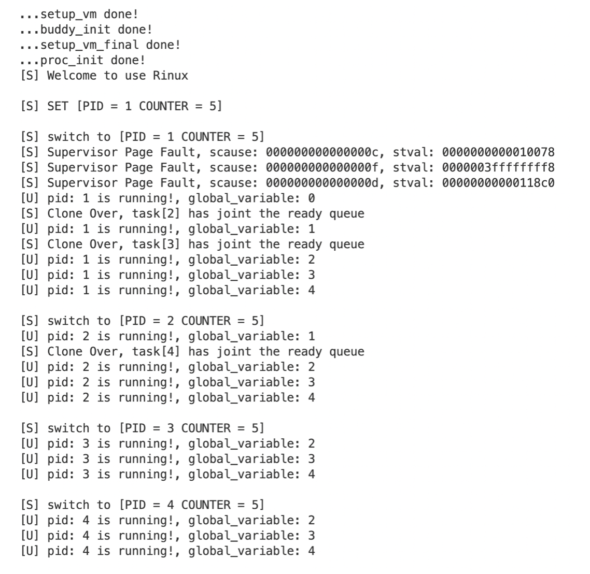

# **浙江大学实验报告**

课程名称：   操作系统     实验类型：     综合型        

实验项目名称：   实验5 RV64 缺页异常处理以及fork机制                     

学生姓名：  管嘉瑞   专业： 计算机科学与技术 学号：  3200102557         

电子邮件地址： 3200102557@zju.edu.cn  手机： 

实验日期： 2022 年  12 月 26 日


# 一、实验目的

- 通过 vm_area_struct 数据结构实现对 task 多区域虚拟内存的管理。
- 添加缺页异常处理 Page Fault Handler。
- 为 task 加入 fork 机制，能够支持通过 fork 创建新的用户态 task 。


# 二、实验内容

- 虚拟内存管理单元vm_area_struct

    

    一个进程需要维护若干个虚拟内存单元。创建进程的时候，可以不预先分配物理空间，而是分配若干个vm_area。发生缺页时才将需要的物理地址分配并映射。这样的好处是充分利用、分配有限的内存空间。

- 缺页异常page fault的处理

    缺页异常是一种正在运行的程序访问当前未由内存管理单元（MMU）映射到虚拟内存的页面时，由计算机**硬件**引发的异常类型。访问未被映射的页或访问权限不足，都会导致该类异常的发生。

    缺页异常发生时，将产生缺页中断调用内核的缺页异常处理函数，缺页异常处理函数会尝试分配物理空间，它会检查出错地址是否在某个权限足够的vma中，如果在，根据vma的内容分配相应空间（其实是磁盘的swap in），否则报地址错误。（真正的Linux缺页处理很复杂，涉及到多种条件分支）

- fork的实现

    fork是重要的系统调用，会拷贝父进程的数据，生成新的子进程，并加入ready queue，下一次调度时这个新进程也参与了调度。Linux的fork采用copy on write的机制，本实验中为了简化直接复制即可。在fork时应该保存、修改父进程的哪些变量是最重要也是最容易出错的部分，另外还要注意fork之后的返回路径。


# 三、主要仪器设备

riscv-64服务器环境

操作系统：Linux 5.4.0-121-generic

主要工具：docker, qemu, riscv-gnu-toolchain

# 四、操作方法和实验步骤

1. 实现vma、demand paging的虚拟页面分配

    ```c
    //demand paging
    void do_mmap(struct task_struct *task, uint64_t addr, uint64_t length, uint64_t flags,
        uint64_t file_offset_on_disk, uint64_t vm_content_offset_in_file, uint64_t vm_content_size_in_file) {
        struct vm_area_struct* vma = &(task->vmas[task->vma_cnt++]);
        vma->vm_start = addr;
        vma->vm_end = addr + length;
        vma->vm_flags = flags;
        vma->file_offset_on_disk = file_offset_on_disk;
        vma->vm_content_offset_in_file = vm_content_offset_in_file;
        vma->vm_content_size_in_file = vm_content_size_in_file;
        vma->if_alloc 
    ```

2. 实现page fault handler、demand paging

    在缺页发生时，检查是否访问的合法地址，如果是，映射一页的空间。

    ```c
    void do_page_fault(struct pt_regs *regs) {
        printk("[S] Supervisor Page Fault, scause: %lx, stval: %lx\n", regs->scause, regs->stval);
        struct vm_area_struct* vma = find_vma(current, regs->stval);
    
        if (!vma) {
            printk("Invalid address.");
            return;
        }
    
        uint64_t page = alloc_page();
        create_mapping((uint64*)PA2VA((uint64_t)current->pgd), PGROUNDDOWN(regs->stval), VA2PA(page), 1, (vma->vm_flags & (~(uint64_t)VM_ANONYM)) | PTE_U_MASK | PTE_V_MASK);
    
        if (!(vma->vm_flags & VM_ANONYM)) { 
            uint64_t load_addr = (vma->file_offset_on_disk + vma->vm_content_offset_in_file);
            if (regs->stval - vma->vm_start < PGSIZE) { 
                memcpy((void*)(page + PGOFFSET(regs->stval)), (void*)load_addr, MIN(PGSIZE - PGOFFSET(regs->stval), vma->vm_end - vma->vm_start));
            }
            else 
            { 
                memcpy((void*)(page), (void*)(load_addr) + regs->stval - vma->vm_start, MIN(PGSIZE, vma->vm_end - regs->stval));
            }
        }
    
        vma->if_alloc = 1;
    }
    ```

3. fork的实现

    fork函数调用时会产生系统中断，调用sys_clone函数，完成子进程的创建。另外在调度过程的switch_to中，必须注意要额外交换内核态和用户态的栈指针。

    父 task 的返回路径：`sys_clone->trap_handler->_traps->user program`,  子进程返回路径: `__switch_to->__ret_from_fork(in _traps)->user program`.

    在sys_clone的进程信息复制过程中，一定要注意有一些指是不能跟随父进程进程管理块一起复制过来的。子进程的任务指针是新创建的，地址与父进程不同，pid不同，ra要设为__ret_from_fork。最重要的是thread.sp这个成语变量，不能拷贝父进程的，而必须设为子进程寄存器栈的指针，这个指针地址相对于子进程task结构体的偏移等于父进程reg指针相对于其task结构体的偏移。只有这样，ret_from_fork的时候才能正常得到寄存器中的值。

    另外对于父进程中已分配的空间，子进程也要予以分配。

    ```c
    long sys_clone(struct pt_regs *regs) {
        // create and initialize a new task
        int pid = 1; // the new pid
        while(task[pid] && pid < NR_TASKS) pid++; // find the first empty task_struct
        if (pid == NR_TASKS) { 
            printk("[S] Exceeds maximum thread number.\n");
            return -1;
        }
    
        uint64_t task_addr = alloc_page();
        task[pid] = (struct task_struct*)task_addr;
        memcpy(task[pid], current, PGSIZE); // copy PCB 
        task[pid]->pid = pid;
        task[pid]->thread.ra = (uint64_t)(&__ret_from_fork);
        
        struct pt_regs *child_pt_regs = (struct pt_regs*)(task_addr + PGOFFSET((uint64_t)regs));
        task[pid]->thread.sp = (uint64_t)child_pt_regs;
    
        child_pt_regs->reg[9] = 0; // child process return 0
        child_pt_regs->reg[1] = task[pid]->thread.sp; 
        child_pt_regs->sepc = regs->sepc + 4;
    
        task[pid]->pgd = (pagetable_t)alloc_page();
        memcpy((void*)(task[pid]->pgd), (void*)((&swapper_pg_dir)), PGSIZE);
        task[pid]->pgd = (pagetable_t)VA2PA((uint64_t)task[pid]->pgd); // turn physical address
        for (int i = 0; i < current->vma_cnt; i++) {
            struct vm_area_struct *vma = &(current->vmas[i]);
            if (vma->if_alloc) {
                uint64_t copy_head = vma->vm_start;
                while (copy_head < vma->vm_end) {
                    if (!has_mapping((pagetable_t)PA2VA((uint64_t)current->pgd), PGROUNDDOWN(copy_head))) {
                        copy_head += PGSIZE; 
                        continue;
                    }
                    uint64_t page = alloc_page();
                    create_mapping((uint64*)PA2VA((uint64_t)task[pid]->pgd), PGROUNDDOWN(copy_head), VA2PA(page), 1, (vma->vm_flags & (~(uint64_t)VM_ANONYM)) | PTE_U_MASK | PTE_V_MASK);
                    memcpy((void*)page, (void*)PGROUNDDOWN(copy_head), PGSIZE); // using kernel virtual address to copy
                    copy_head += PGSIZE;
                }
            }
        }
    
        printk("[S] Clone Over, task[%d] has joint the ready queue\n", pid);
        return pid;
    }
    ```

    

# 五、实验结果和分析

打开终端，进入docker。

\### Terminal 1

\#make run

- 测试1：双fork

    main函数：

    ```c
    int main() {
    
        printf("[U] pid: %ld is running!, global_variable: %d\n", getpid(), global_variable++);
        fork();
    
        printf("[U] pid: %ld is running!, global_variable: %d\n", getpid(), global_variable++);
        fork();
    
        while(1) {
            printf("[U] pid: %ld is running!, global_variable: %d\n", getpid(), global_variable++);
            for (unsigned int i = 0; i < 0x1000FFFE; i++);
        }
    }
    ```

    测试结果（运行截图）：

    

    可以看到一共产生了四个进程，除了一个父进程外还有三个子进程。之所以两次fork会产生三个子进程，是因为第四个子进程是由第一次fork产生的子进程继续执行，在子进程内部再执行fork生成的“孙进程”，符合fork的原理。

    

- 测试2：斐波那契数列

    main函数：

    ```c
    int main() {
      for (int i = 0; i < LARGE; i++) {
        something_large_here[i] = i;
      }
      int pid = fork();
      printf("[U] fork returns %d\n", pid);
    
      if (pid == 0) {
        while(1) {
          global_variable++;
          printf("[U-CHILD] pid: %ld is running! the %dth fibonacci number is %d and the number @ %d in the large array is %d\n", getpid(), global_variable, fib(global_variable), LARGE - global_variable, something_large_here[LARGE - global_variable]);
          for (int i = 0; i < 0x7FFFFFF; i++);
        }
      } else {
        while (1) {
          global_variable++;
          printf("[U-PARENT] pid: %ld is running! the %dth fibonacci number is %d and the number @ %d in the large array is %d\n", getpid(), global_variable, fib(global_variable), LARGE - global_variable, something_large_here[LARGE - global_variable]);
          for (int i = 0; i < 0x7FFFFFF; i++);
        }
      }
    }
    ```

    测试结果：

    

    可以看到父子进程对斐波那契数列的计算结果相同且正确，一定程度上验证了用户保存、交换的逻辑正确性。

    另外也可以看到这两个例子中page fault在父进程中产生、处理，有代码段产生的缺页也有栈区产生的缺页。子进程由于在创建时分配了父进程已分配的空间，执行时未产生缺页。


# 六、问题解答

1. `uint64_t vm_content_size_in_file;` 对应的文件内容的长度。为什么还需要这个域?

    vm_end - vm_start未必等于文件的总长，可能未分配完全。

2. `struct vm_area_struct vmas[0];` 为什么可以开大小为 0 的数组? 这个定义可以和前面的 vma_cnt 换个位置吗?

    这是C语言的一种语法：变长数组(VLA)，又称柔性数组。

    使用这种语法时，这一变长数组项只能有一个且只能是最后一个成员。此数组不会被直接分配空间，而是在使用时直接取地址。所以在使用变长数组时，一般都要为结构体指针动态分配一定长度的内存、规定最大长度，防止内存越界。

3. 想想为什么只要拷贝那些已经分配并映射的页，那些本来应该被分配并映射，但是暂时还没有因为 Page Fault 而被分配并映射的页怎么办?

    由于父进程的vma也被拷贝了，子进程可以在需要的时候产生缺页中断来映射。

4. 参考 task_init 创建一个新的 task, 将的 parent task 的整个页复制到新创建的 task_struct 页上, 这一步复制了哪些东西?

    除了thread.sp、thread.ra、thread.pid，以及寄存器组中的a0、a7、sepc，以及页表指针。其他全部复制。

5. 将 thread.ra 设置为 `__ret_from_fork`, 并正确设置 `thread.sp`。仔细想想，这个应该设置成什么值?可以根据 child task 的返回路径来倒推。

    ```c
    struct pt_regs *child_pt_regs = (struct pt_regs*)(task_addr + PGOFFSET((uint64_t)regs));
    task[pid]->thread.sp = (uint64_t)child_pt_regs;
    ```

    thread.sp的值如上，其中child_pt_regs指针跟子进程task指针的位置关系，跟父进程regs和其task指针的位置关系是镜像的，这样才能保证返回时能读到正确的上下文。

6. 利用参数 regs 来计算出 child task 的对应的 pt_regs 的地址，并将其中的 a0, sp, sepc 设置成正确的值。为什么还要设置 sp?

    ```c
        child_pt_regs->reg[9] = 0; // child process return 0
        child_pt_regs->reg[1] = task[pid]->thread.sp; 
        child_pt_regs->sepc = regs->sepc + 4;
    ```

    设成的值如上。设置sp与thread.sp保持一致，这个值在_ret_fom_fork时会被赋给子进程的sp寄存器，必须设置。


# 七、讨论、心得

1. 本实验只是简单模拟了缺页中断的情况，实际中涉及到磁盘文件的定位、文件块的swap in、swap out，要比本实验实现的复杂。
1. 本实验最为复杂也是我卡住最久的地方是fork时上下文保存、返回路径逻辑的部分，容易出错且不好debug。
1. 刚开始我想给每个新建的子进程都不映射空间，等其缺页再分配，这样貌似节省空间。后来发现这样不仅不能完全拷贝vma(需要修改分配标志位)，而且在逻辑上也没有必要，因为父进程分配的子进程大概率也要得到。
1. 本实验是跟用户模式结合在一起做的，整体挑战还是蛮大的。


