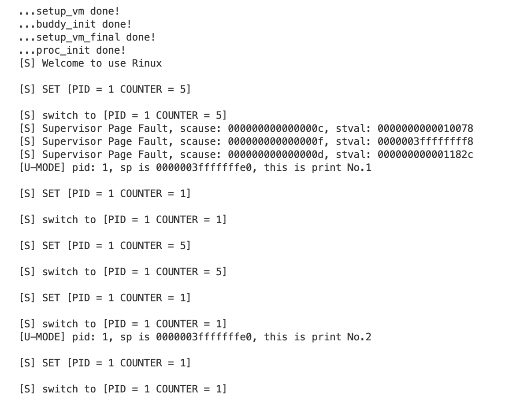

# **浙江大学实验报告**

课程名称：   操作系统     实验类型：     综合型        

实验项目名称：   实验6 RV64 用户模式 

学生姓名：  管嘉瑞   专业： 计算机科学与技术 学号：  3200102557         

电子邮件地址： 3200102557@zju.edu.cn  手机：       

实验日期： 2022 年  12 月 26 日

(说明：本实验在其他班是lab5，而在李善平老师班为lab6，作为bonus。lab5则是缺页及fork。本人将两个实验合并在一起做了)


# 一、实验目的

* 创建用户态进程，并设置 `sstatus` 来完成内核态转换至用户态。
* 正确设置用户进程的**用户态栈**和**内核态栈**， 并在异常处理时正确切换。
* 补充异常处理逻辑，完成指定的系统调用（ SYS_WRITE, SYS_GETPID ）功能。

# 二、实验内容

创建用户态进程、添加两个系统调用、修改进程调度转换逻辑、添加ELF支持。

# 三、主要仪器设备

riscv-64服务器环境

操作系统：Linux 5.4.0-121-generic

主要工具：docker, qemu, riscv-gnu-toolchain


# 四、操作方法和实验步骤

1. 修改 `vmlinux.lds.S`，将用户态程序 `uapp` 加载至 `.data` 段。

    ```
    .data : ALIGN(0x1000){
            _sdata = .;
    
            *(.sdata .sdata*)
            *(.data .data.*)
    
            _edata = .;
            
            . = ALIGN(0x1000);
            uapp_start = .;
            *(.uapp .uapp*)
            uapp_end = .;
            . = ALIGN(0x1000);
    
        } >ramv AT>ram
    ```

2. 修改 task_init

    * 对每个用户态进程，其拥有两个 stack： `U-Mode Stack` 以及 `S-Mode Stack`， 其中 `S-Mode Stack` 在 `lab3` 中我们已经设置好了。通过 `alloc_page` 接口申请一个空的页面来作为 `U-Mode Stack`。
    * 对每个用户态进程我们需要将 `sepc` 修改为 `USER_START`，配置修改好 `sstatus` 中的 `SPP` （ 使得 sret 返回至 U-Mode ）， `SPIE` （ sret 之后开启中断 ）， `SUM` （ S-Mode 可以访问 User 页面 ）， `sscratch` 设置为 `U-Mode` 的 sp，其值为 `USER_END` （即  `U-Mode Stack` 被放置在 `user space` 的最后一个页面）。

    ```c
    void task_init() {
        memset(task, 0, NR_TASKS * sizeof(task));
    
        uint64_t addr_idle = kalloc();
        idle = (struct task_struct*)addr_idle;
        idle->state = TASK_RUNNING;
        idle->counter = idle->priority = 0;
        idle->pid = 0;
        idle->pgd = swapper_pg_dir; 
        idle->thread.sscratch = 0;
    
        current = task[0] = idle;
        uint64_t task_addr = kalloc();
        task[1] = (struct task_struct*)task_addr;
        task[1]->state = TASK_RUNNING;
        task[1]->counter = 0;
        task[1]->priority = rand() % 10 + 1;
        task[1]->pid = 1;
    
        task[1]->pgd = (pagetable_t)alloc_page();
        memcpy((void*)(task[1]->pgd), (void*)((&swapper_pg_dir)), PGSIZE);
        task[1]->pgd = (pagetable_t)VA2PA((uint64_t)task[1]->pgd); // turn physical address
        load_elf_program(task[1]);
    
        task[1]->thread.ra = (uint64_t)__dummy;
        task[1]->thread.sp = task_addr + PGSIZE; // initialize kernel stack pointer
    
        printk("...proc_init done!\n");
    }
    ```

3. 修改中断入口, 返回逻辑 ( _trap ) 以及中断处理函数

    由于我们的用户态进程运行在 `U-Mode` 下， 使用的运行栈也是 `U-Mode Stack`， 因此当触发异常时， 我们首先要对栈进行切换 （ `U-Mode Stack` -> `S-Mode Stack` ）。同理让我们完成了异常处理， 从 `S-Mode` 返回至 `U-Mode`， 也需要进行栈切换 （ `S-Mode Stack` -> `U-Mode Stack` ）。

    `uapp` 使用 `ecall` 会产生 `ECALL_FROM_U_MODE` **exception**。因此我们需要在 `trap_handler` 里面进行捕获。

4. 添加系统调用

    * 64 号系统调用 `sys_write(unsigned int fd, const char* buf, size_t count)` 该调用将用户态传递的字符串打印到屏幕上，此处fd为标准输出（1），buf为用户需要打印的起始地址，count为字符串长度，返回打印的字符数。( 具体见 user/printf.c )
    * 172 号系统调用 `sys_getpid()` 该调用从current中获取当前的pid放入a0中返回，无参数。（ 具体见 user/getpid.c ）

    ```c
    long sys_write(unsigned int fd, const char* buf, int count) {
        uint64_t res = 0;
        for (int i = 0; i < count; i++) {
            if (fd == 1) {
                printk("%c", buf[i]);
                res++;
            }
        }
        return res;
    }
    
    long sys_getpid() {
        return current->pid;
    }
    ```

5. 添加ELF支持

    将 `uapp.S` 中的 payload 换成我们的 ELF 文件。另外需要便携载入elf文件的函数。

    ```c
    static uint64_t load_elf_program(struct task_struct* task) {
        Elf64_Ehdr* ehdr = (Elf64_Ehdr*)(&uapp_start);
    
        int phdr_cnt = ehdr->e_phnum;
        uint64_t phdr_start = (uint64_t)ehdr + ehdr->e_phoff;
    
        Elf64_Phdr* phdr;
        int load_phdr_cnt = 0;
        for (int i = 0; i < phdr_cnt; i++) 
        {
            phdr = (Elf64_Phdr*)(phdr_start + sizeof(Elf64_Phdr) * i);
            if (phdr->p_type == PT_LOAD) {
                // initialize vma
                uint64_t pg_num = (PGOFFSET(phdr->p_vaddr) + phdr->p_memsz - 1) / PGSIZE + 1;
                do_mmap(task, phdr->p_vaddr, pg_num * PGSIZE, (phdr->p_flags << 1), (uint64_t)&uapp_start, phdr->p_offset, phdr->p_filesz);
            }
        }
    
        do_mmap(task, USER_END - PGSIZE, PGSIZE, VM_R_MASK | VM_W_MASK | VM_ANONYM, (uint64_t)&uapp_start, 0, 0);
    
        // user stack
        task->thread.sscratch = USER_END;
        task->thread.sepc = ehdr->e_entry; // the program starting address
        // sstatus bits
        task->thread.sstatus = (1 << 18) | (1 << 5);
    }
    ```

    

# 五、实验结果和分析

打开终端，进入docker。

\### Terminal 1

\#make run

测试用户程序：

```c
int main() {
    register unsigned long current_sp __asm__("sp");
    while (1) {
        printf("[U-MODE] pid: %ld, sp is %lx, this is print No.%d\n", getpid(), current_sp, ++global_variable);
        for (unsigned int i = 0; i < 0x4FFFFFFF; i++);
    }

    return 0;
}
```

测试结果：



本实验跟缺页、fork一起实现，所以这里有缺页中断的输出。

可以看到用户程序正常执行，全部变量值依次递增。


# 六、问题解答

1. 我们在实验中使用的用户态线程和内核态线程的对应关系是怎样的？（一对一，一对多，多对一还是多对多）

    一对多。并没有多个内核态进程分别管理内核态进程。

2. 为什么 Phdr 中，`p_filesz` 和 `p_memsz` 是不一样大的？

    p_memsz大于或等于p_filesz, 因为内存段可能会存在.bass节。

3. 为什么多个进程的栈虚拟地址可以是相同的？用户有没有常规的方法知道自己栈所在的物理地址？

    进程运行时使用虚拟地址，自己有一份自己的页表，相同的虚拟地址在不同的进程页表上可能映射到不同的物理空间，不会出现冲突。这种机制有利于虚拟地址管理简单、有利于隔离性。

    如果知道映射规则可以知道。可以内核提供的接口pagemap，或者在linux中，某一task的虚拟内存区域映射关系可以通过procfs读取 `/proc/pid/maps` 的内容来获取，根据这个可以知道物理地址。

    

# 七、讨论、心得

个人觉得这个实验最难的地方是用户态新增了用户栈等概念，在进程切换时需要尤为细心。

另外ELF支持方面也比较复杂，本人按照实验指导逐步做出，但感觉对其本质还没有完全理解透，后续将加强学习。


